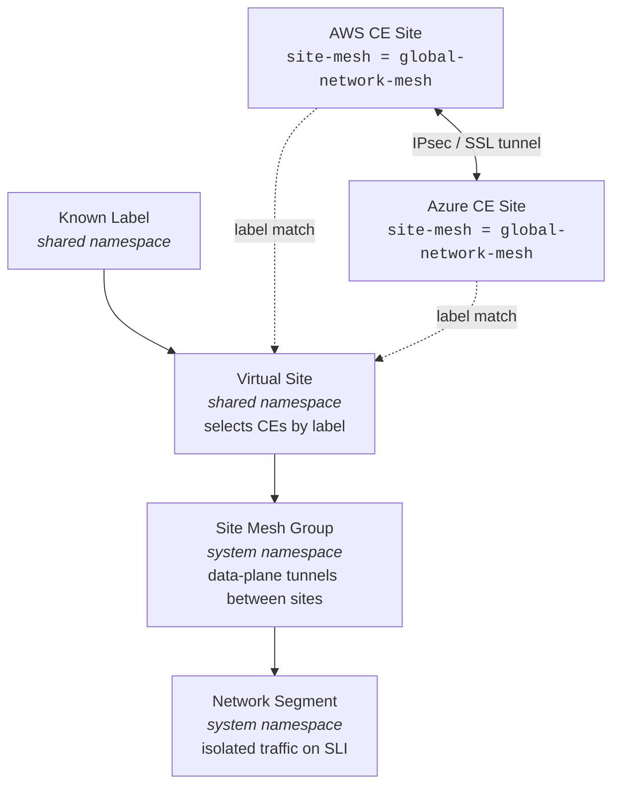

# F5 XC Multi-Cloud Network (MCN) Core Terraform

Terraform configuration that defines the **core F5 Distributed Cloud (XC) Multi-Cloud Network fabric** used by external CE site deployments.

## Concepts

### Site Mesh Groups

A [Site Mesh Group](https://docs.cloud.f5.com/docs-v2/platform/concepts/site) enables direct site-to-site connectivity between Customer Edge (CE) nodes **without routing traffic through F5 Regional Edges (REs)**. Sites in a mesh group build IPsec or SSL tunnels directly between each other over the SLO (outside) interface.

This module creates a **full mesh** with **data-plane only** connectivity -meaning all member sites can exchange workload traffic directly, but control-plane operations still flow through the REs. Sites are selected into the mesh via a label + virtual site selector pattern.

### Network Segments

[Network Segments](https://docs.cloud.f5.com/docs-v2/multi-cloud-network-connect/how-tos/networking/segmentation) provide logical network isolation across the MCN fabric. A segment extends a consistent network boundary across multiple CE sites -workloads on the same segment at different sites can communicate over the mesh, while workloads on different segments are isolated.

Segments are assigned to the SLI (inside) interface of each CE node. This is a [Day-2 operation](#1-segment-interface-configuration) because the XC API does not allow interface configuration until after the CE registers and its nodes are auto-discovered.

### How They Work Together



Each CE site carries a label (e.g. `site-mesh = global-network-mesh`). The virtual site selects all CEs with that label. The site mesh group references the virtual site to form tunnels. Segments then ride over those tunnels to provide isolated connectivity between the inside networks.

For more on these concepts, see the [F5 XC Site documentation](https://docs.cloud.f5.com/docs-v2/platform/concepts/site) and [Networking concepts](https://docs.cloud.f5.com/docs-v2/platform/concepts/networking).

## What This Deploys

### Shared XC Objects (always created)
- **Known Label** (`shared`) -label key + value used to select CE sites into the mesh
- **Virtual Site** (`shared`) -CE-type virtual site with label selector
- **Site Mesh Group** (`system`) -full mesh, data-plane only
- **Network Segment** (`system`) -logical network segmentation

### Optional CE Site Modules
- **[AWS GovCloud CE](https://github.com/Mikej81/xc-ce-aws-gov-tf)** -toggleable via `aws_ce` variable
- **[Azure GovCloud CE](https://github.com/Mikej81/xc-ce-azure-gov-tf)** -toggleable via `azure_ce` variable

## Prerequisites

### F5 XC API Credentials
1. Log into your F5 XC Console
2. Navigate to **Administration > Credentials**
3. Create an **API Certificate** (P12 format)
4. Save the `.p12` file to `./creds/` (this directory is gitignored)
5. Note the password -export it as `VES_P12_PASSWORD` environment variable

### Cloud Provider Authentication

**AWS GovCloud** (if deploying `aws_ce`):
- AWS CLI configured with a GovCloud profile
- IAM permissions for EC2, S3, VPC, IAM (vmimport role)

**Azure Government** (if deploying `azure_ce`):
- Azure CLI authenticated to an Azure Government subscription (`az cloud set --name AzureUSGovernment && az login`)
- Contributor role on the target subscription

## Usage

### 1. Configure Variables

```bash
cp terraform.tfvars.example terraform.tfvars
```

Edit `terraform.tfvars` with your values:

```hcl
# Required -F5 XC API
f5xc_api_url      = "https://<tenant>.console.ves.volterra.io/api"
f5xc_api_p12_file = "./creds/<tenant>.api-creds.p12"
```

### 2. Deploy Core Objects Only

Leave `aws_ce` and `azure_ce` as `null` (default) to deploy only the shared MCN objects:

```bash
export VES_P12_PASSWORD="<your-p12-password>"
terraform init
terraform plan
terraform apply
```

### 3. Deploy with CE Sites

Add CE site configurations to `terraform.tfvars`:

```hcl
# Azure GovCloud CE
azure_ce = {
  site_name      = "mcn-azure-gov-ce"
  ssh_public_key = "ssh-rsa AAAA..."
}

# AWS GovCloud CE
aws_ce = {
  site_name         = "mcn-aws-gov-ce"
  ssh_public_key    = "ssh-rsa AAAA..."
  vpc_id            = "vpc-0123456789abcdef0"
  outside_subnet_id = "subnet-0123456789abcdef0"
  inside_subnet_id  = "subnet-0123456789abcdef1"
  aws_region        = "us-gov-west-1"
  aws_profile       = "govcloud"
}
```

Then apply:

```bash
terraform apply
```

## Day-2 Operations

### Why Day-2?

The XC API does not allow node or interface configuration during SMSv2 site creation -nodes are **auto-discovered during registration**. The `node_list` on the site object remains empty until the CE completes provisioning and comes ONLINE. This means segment interface assignment, and any other per-node configuration, must happen after initial deployment.

### Site Lifecycle

After `terraform apply`, each CE site progresses through these states:

| State | Duration | What's Happening |
|-------|----------|------------------|
| WAITING_FOR_REGISTRATION | 5–10 min | VM booted, cloud-init running, CE contacting RE |
| PROVISIONING | 10–20 min | Site registered, services initializing |
| UPGRADING | 15–30 min | Downloading target SW version, rebooting |
| ONLINE | -| Ready for Day-2 configuration |

You can monitor status in the Console or via the API:

```bash
curl -s -H "Authorization: APIToken <token>" \
  "https://<tenant>/api/config/namespaces/system/securemesh_site_v2s/<site-name>" \
  | jq '.spec.site_state'
```

### 1. Segment Interface Configuration

Network segments are created by this module but **segment interfaces on CE sites must be configured after the site is ONLINE**. This assigns the SLI (inside) interface to a [network segment](https://docs.cloud.f5.com/docs-v2/multi-cloud-network-connect/how-tos/networking/segmentation), enabling cross-site segment routing over the mesh.

#### Option A: XC Console (UI)

1. Navigate to **Multi-Cloud Network Connect > Manage > Site Management > [Secure Mesh Sites v2](https://docs.cloud.f5.com/docs-v2/multi-cloud-network-connect/how-to/site-management/create-secure-mesh-site-v2)**
2. Find your site and click **Edit**
3. Scroll to **Node Information** -you should see the auto-discovered node
4. Click the node to expand it, then edit the **SLI interface**
5. Change `Network Option` from **Site Local Inside Network** to **Segment Network**
6. Select the target segment (e.g. `prod`)
7. Click **Save and Exit**

#### Option B: XC API

First, GET the current site config to capture the auto-discovered node name and existing spec:

```bash
curl -s -H "Authorization: APIToken <token>" \
  "https://<tenant>/api/config/namespaces/system/securemesh_site_v2s/<site-name>" \
  | jq '.spec.node_list'
```

Then PUT the updated site config with the segment interface. The key change is replacing `site_local_inside_network` with `segment_network` on the SLI interface. The `segment_network` value is a flat object reference with `name`, `namespace`, and `tenant`:

> **Important:** The PUT replaces the full spec. You must include the `resource_version` from the GET response and all existing spec fields to avoid dropping configuration or hitting a version mismatch error.

```bash
# 1. Fetch current config
CURRENT=$(curl -s -H "Authorization: APIToken <token>" \
  "https://<tenant>/api/config/namespaces/system/securemesh_site_v2s/<site-name>")

# 2. Update the SLI interface network_option and PUT back
echo "$CURRENT" | jq '
  # Find the SLI interface (eth1) and change its network_option
  (.spec.azure.not_managed.node_list[0].interface_list[] |
    select(.name == "eth1")).network_option = {
      "segment_network": {
        "name": "<segment-name>",
        "namespace": "system",
        "tenant": "<tenant-id>"
      }
    }
  |
  # Build the replace request body
  {
    metadata: {
      name: .metadata.name,
      namespace: .metadata.namespace,
      labels: .metadata.labels,
      description: .metadata.description,
      annotations: .metadata.annotations,
      disable: .metadata.disable
    },
    resource_version: .resource_version,
    spec: .spec
  }
' | curl -s -X PUT \
  -H "Authorization: APIToken <token>" \
  -H "Content-Type: application/json" \
  "https://<tenant>/api/config/namespaces/system/securemesh_site_v2s/<site-name>" \
  -d @-
```

> **Note:** For AWS CE sites, the path within the spec is `spec.aws.not_managed.node_list` instead of `spec.azure.not_managed.node_list`. Adjust the `jq` path accordingly.

### 2. Verify Site Mesh Connectivity

After both CE sites are ONLINE with matching labels, verify the site mesh group is formed:

1. **Console:** Navigate to **Multi-Cloud Network Connect > Networking > Site Mesh Groups** > click your mesh group > check **Topology** tab
2. **API:**

```bash
# Check mesh topology
curl -s -X POST \
  -H "Authorization: APIToken <token>" \
  -H "Content-Type: application/json" \
  "https://<tenant>/api/data/namespaces/system/topology/site_mesh_group/<mesh-name>" \
  -d '{}' | jq '.sites'
```

### 3. Verify Segment Connectivity

Once segment interfaces are configured on both CE sites, verify end-to-end segment routing:

1. **Console:** Navigate to **Multi-Cloud Network Connect > Networking > Segments** > click the segment > check connected sites
2. **Test connectivity:** From a workload on the SLI subnet of one CE, ping or curl a workload on the SLI subnet of the other CE -traffic should route through the segment over the data-plane mesh

## Inputs

| Variable | Required | Default | Description |
|----------|----------|---------|-------------|
| `f5xc_api_url` | yes | -| F5 XC tenant API URL |
| `f5xc_api_p12_file` | yes | -| Path to API P12 credential file |
| `mesh_name` | no | `global-network-mesh` | Name for virtual site and site mesh group |
| `site_mesh_label_key` | no | `site-mesh` | Label key for CE site selection |
| `site_mesh_label_value` | no | `global-network-mesh` | Label value for mesh membership |
| `segments` | no | `{ prod = {...} }` | Map of network segments to create |
| `aws_ce` | no | `null` | AWS GovCloud CE config object (null = skip) |
| `azure_ce` | no | `null` | Azure GovCloud CE config object (null = skip) |

## Outputs

| Output | Description |
|--------|-------------|
| `virtual_site_name` | Name of the virtual site |
| `site_mesh_group_name` | Name of the site mesh group |
| `segment_names` | Map of created segment names |
| `site_label` | Label expression CE sites must carry |

## References

- [F5 XC Site Concepts](https://docs.cloud.f5.com/docs-v2/platform/concepts/site) -sites, virtual sites, labels, site mesh groups
- [Networking Concepts](https://docs.cloud.f5.com/docs-v2/platform/concepts/networking) -virtual networks, network connectors
- [Network Segmentation](https://docs.cloud.f5.com/docs-v2/multi-cloud-network-connect/how-tos/networking/segmentation) -creating and managing segments
- [Create Secure Mesh Site v2](https://docs.cloud.f5.com/docs-v2/multi-cloud-network-connect/how-to/site-management/create-secure-mesh-site-v2) -SMSv2 site deployment guide
- [Volterra Terraform Provider](https://registry.terraform.io/providers/volterraedge/volterra/latest/docs) -provider documentation
- [F5 XC API Automation](https://docs.cloud.f5.com/docs-v2/platform/how-to/volt-automation/apis) -API authentication and usage
